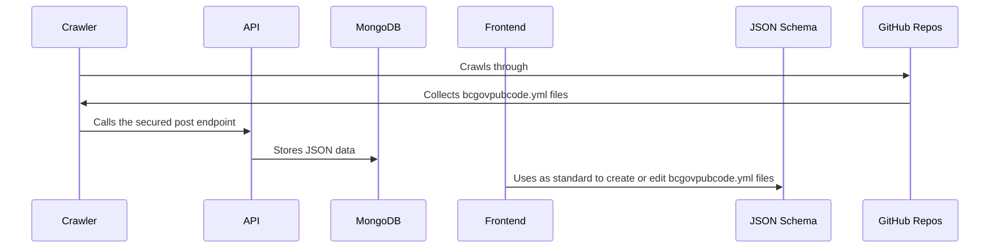

<!-- PROJECT SHIELDS -->

# BCGov public code asset tracking.

It Contains schema definitions for the yml file, web application that allows users to create and edit bcgovpubcode.yml files, store them in a MongoDB database, and retrieve them using a Node/Express API.

## Components

1. DB (MongoDB): Stores all bcgovpubcode.yml files as JSON from each repo under bcgov org.
2. Backend (Node/Express API): Provides read and write access to the MongoDB database. The write endpoint is protected by an API key and the read endpoint is open to the public. All endpoints are rate-limited.
3. Crawler (Node module): Crawls through GitHub repos on a schedule basis, collects bcgovpubcode.yml files if present, converts them to JSON, and calls the API's post endpoint.
4. Frontend (React.js and MaterialUI): Allows users to create a bcgovpubcode.yml from scratch or edit one by providing a GitHub link.
5. Schema (JSON Schema): The standard based on which the bcgovpubcode.yml file gets built.

## How it works

1. The Crawler runs on a schedule in GitHub Actions and collects bcgovpubcode.yml files from GitHub repositories [[crawler workflow file.]]( .github/workflows/pubcode-crawler-on-scheduler.yml).
2. The bcgovpubcode.yml files are converted to JSON and sent to the APIs post endpoint which is a secured endpoint, by API_KEY.
3. The API stores the JSON data in the MongoDB database.
4. Users can access all the data from read endpoint of the API.
5. Frontend allows users tp create or edit bcgovpubcode.yml files which validates the data against the JSON Schema [schema](schema/bcgovpubcode.json).

## Note

Only the Crawler module is allowed to call the APIs post endpoint, which is the source of truth for the data in the MongoDB database.

#### For more details about individual modules please follow the readme files in the respective folders.
[backend](backend/README.md)

[schema](schema/README.md)

[frontend](frontend/README.md)

[crawler](crawler/README.md)
