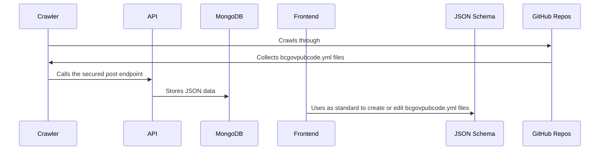

<!-- PROJECT SHIELDS -->

# BCGov public code asset tracking

This contains schema definitions for yml and a web application to assist end users to create/edit bcgovpubcode.yml files, store them in a MongoDB database and retrieve them using a Node/Express API.

## Architecture

## FAQ
Please click [here](https://github.com/bcgov/pubcode/wiki/Frequently-Asked-Questions)

## Components

1. Database (MongoDB): Stores all bcgovpubcode.yml files, converted to JSON, for each participating repo in the bcgov organization.
2. Backend (Node/Express API): Provides read and write access to the database. The read endpoint is open to the public, while the write endpoint is protected by an API key. Both are rate-limited.
3. Crawler (Node module): Crawls through GitHub repos on a schedule, collects any bcgovpubcode.yml files, converts to JSON, and stores using the API's write endpoint.
4. Frontend (React.js and MaterialUI): Allows users to create bcgovpubcode.yml files or edit existing ones using a GitHub link.
5. Schema (JSON Schema): The standard on which the bcgovpubcode.yml file is based.

## How it works

1. The Crawler runs in a [scheduled GitHub Action](.github/workflows/pubcode-crawler-on-scheduler.yml), collecting bcgovpubcode.yml files from participating GitHub repositories.
2. Yaml is converted to JSON and sent to the API's write endpoint, which is secured with an API key.
3. The API stores to the MongoDB database.
4. Users can access all data from the API's read endpoint.
5. Frontend allows users to create or edit bcgovpubcode.yml files, which are validated against the [JSON schema](schema/bcgovpubcode.json).

## Note

Only the Crawler module is allowed to call the APIs post endpoint, which uses the MongoDB as its source of truth.

## More Information

Please see README.md files in each component's folder to learn more.

[api/README.md](api/README.md)

[schema/README.md](schema/README.md)

[frontend/README.md](frontend/README.md)

[crawler/README.md](crawler/README.md)
