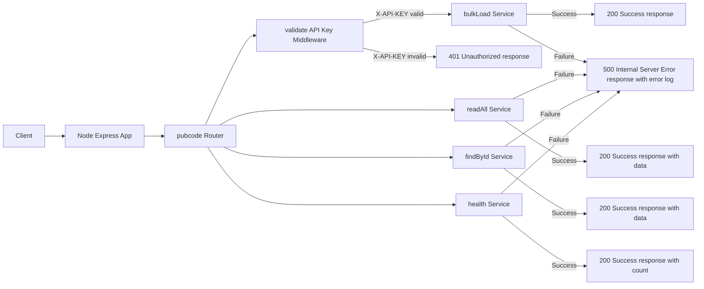

# Node Express App for Pubcode API

This is a Node.js server application utilizing popular libraries and tools, including:

1.  Express: Framework for building web applications
2.  Morgan: Express middleware for logging
3. NoCache: Express middleware for prevent client-side caching
4. Helmet: Express middleware to secure an app using HTTP headers
5. CORS: Express middleware to allows cross-origin resource sharing
6. Body-Parser: Express middleware to parse incoming request for handling
7. Mongoose: MongoDB object modeling tool
8. Logger: Logs messages to the console
9. Express-Rate-Limit: Express middleware for rate limiting by IP
10. Dotenv: Zero-dependency module to loads environment variables (.env)

#### Sample .env

```
DB_HOST=<mongodb-host>
DB_PORT=<mongodb-port>
DB_NAME=<mongodb-database-name>
DB_USER=<mongodb-user>
DB_PWD=<mongodb-password>
API_KEY=<api-key>
```


