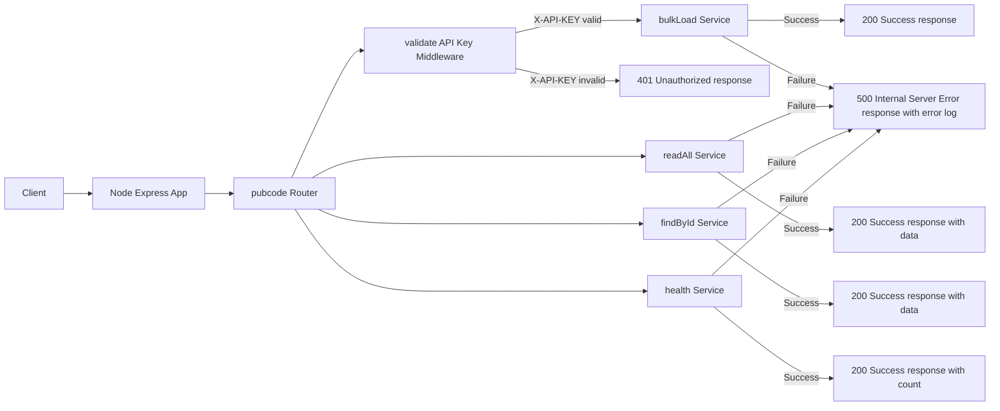

### Node Express App for Pubcode API
This project is a Node.js server application that utilizes a number of popular libraries and tools, including:

1.  Express: a popular framework for building web applications in Node.js
2.  Morgan: a logging middleware for Express
3. NoCache: a middleware for Express to prevent client-side caching
4. Helmet: a set of middlewares to help secure a Express app by setting various HTTP headers
5. CORS: a middleware for Express that allows cross-origin resource sharing
6. Body-Parser: a middleware for Express that allows parsing of incoming request bodies in a middleware before the handlers
7. Mongoose: a MongoDB object modeling tool for Node.js
8. Logger: a custom logger module that writes log messages to the console
9. Express-Rate-Limit: a middleware for Express to limit the number of requests that can be made from a single IP address
10. Dotenv: a zero-dependency module that loads environment variables from a .env file
#### Sample .env
DB_HOST=<mongodb-host>

DB_PORT=<mongodb-port>

DB_NAME=<mongodb-database-name>

DB_USER=<mongodb-user>

DB_PWD=<mongodb-password>

API_KEY=<api-key>

