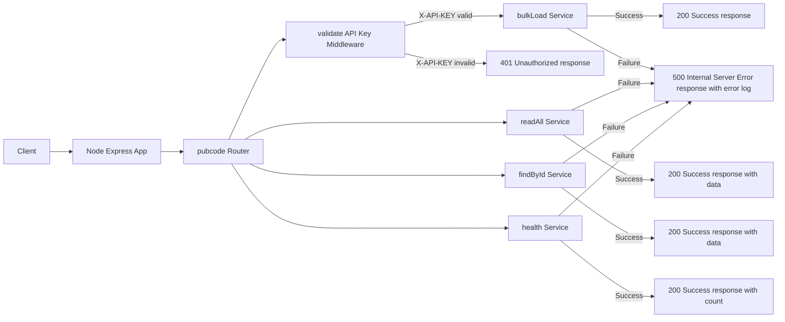

### Node Express App for Pubcode API

```mermaid
graph LR
A[Client] --> B[Node Express App]
B --> C[pubcode Router]
C --> D[validate API Key Middleware]
D -->|X-API-KEY valid| E[bulkLoad Service]
D -->|X-API-KEY invalid| F[401 Unauthorized response]
E -->|Success| G[200 Success response]
E -->|Failure| H[500 Internal Server Error response with error log]
C --> I[readAll Service]
I -->|Success| J[200 Success response with data]
I -->|Failure| H
C --> K[findById Service]
K -->|Success| L[200 Success response with data]
K -->|Failure| H
C --> M[health Service]
M -->|Success| N[200 Success response with count]
M -->|Failure| H
```
