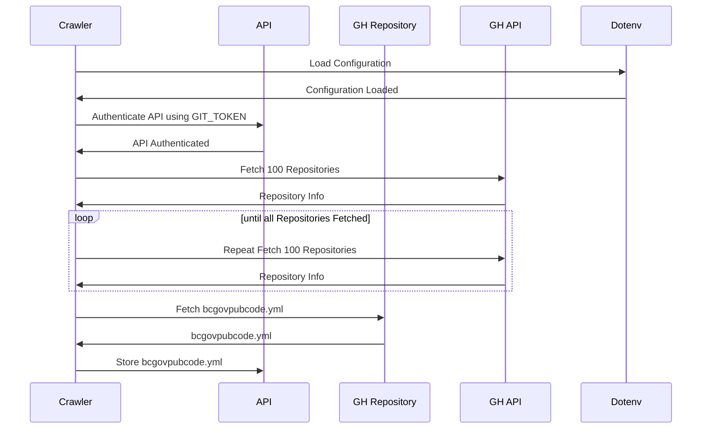

```mermaid
sequenceDiagram
  participant Crawler
  participant API
  participant GH Repository
  participant GH API
  participant Dotenv

  Crawler->>Dotenv: Load Configuration
  Dotenv->>Crawler: Configuration Loaded
  Crawler->>API: Authenticate API using GIT_TOKEN
  API->>Crawler: API Authenticated
  Crawler->>GH API: Fetch 100 Repositories
  GH API->>Crawler: Repository Info
  loop until all Repositories Fetched
    Crawler->>GH API: Repeat Fetch 100 Repositories
    GH API->>Crawler: Repository Info
  end
  Crawler->>GH Repository: Fetch bcgovpubcode.yml
  GH Repository->>Crawler: bcgovpubcode.yml
  Crawler->>API: Store bcgovpubcode.yml

```
